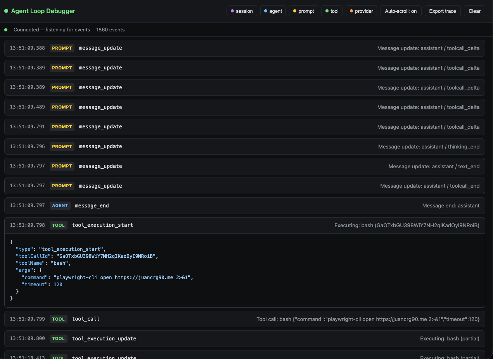
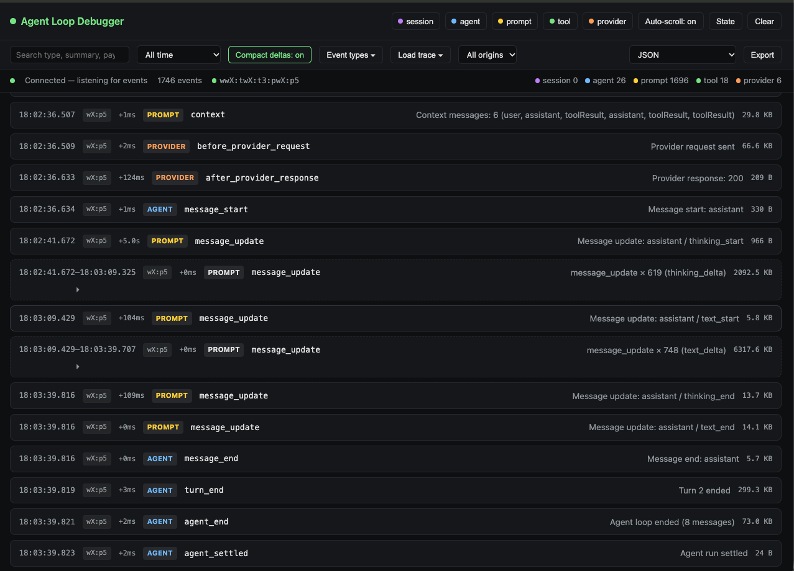
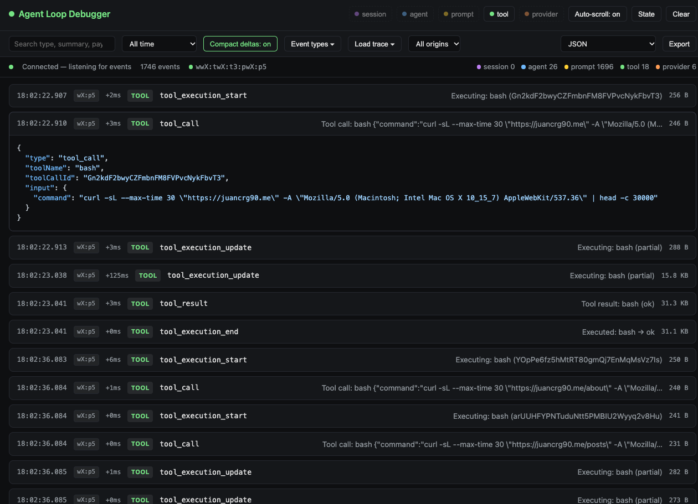
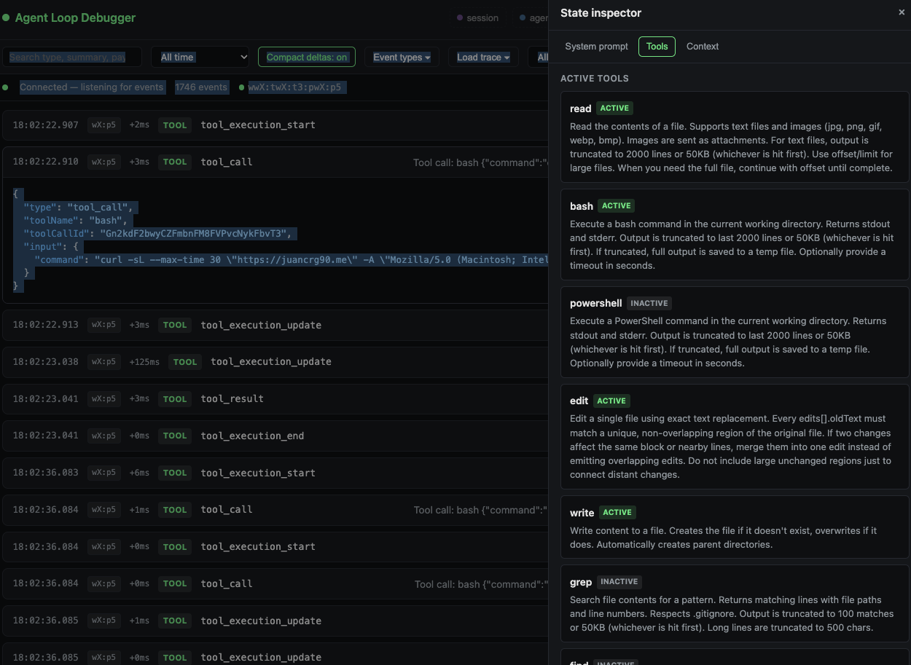

# Agent Loop Debugger

A Pi extension that exposes a `/agentloop` command. Running it starts a small
local web server that serves a real-time debugger, streaming Pi agent lifecycle
events into a browser-based timeline.





## Installation

```bash
pi install npm:@juancrg90/agent-loop-debugger
```

Or test locally:

```bash
pi -e ./packages/agent-loop-debugger
```

## Usage

Inside Pi, run:

```
/agentloop
```

The command toggles the debugger server on and off. When started, it prints a
local URL such as `http://127.0.0.1:54321`. Open that URL in a browser to see
live events.

### Commands

- `/agentloop` — start or stop the debugger server.
- `/agentloop list` — list saved trace files with index, timestamp, and event count.
- `/agentloop load <index|filename>` — load a saved trace into the timeline.
- `/agentloop --herdr` — show the current Herdr context (pane/tab/workspace IDs) if running under Herdr.

Traces are auto-saved to `~/.pi/agent/agent-loop-debugger/traces/` on every
`session_shutdown` and when the server stops.

### Webapp controls

- **Category toggles** — show or hide events by category.
- **Event type filter** — dynamically discover event types and toggle each one on or off.
- **Text search** — filter events by text in the event type, summary, or stringified payload. Input is debounced so filtering stays responsive.
- **Time range filter** — show only events from the last 30 seconds, 1 minute, 5 minutes, or all time, relative to the most recent event.
- **Compact deltas** — collapse 3+ consecutive `message_update` events of the same delta type into a single compact row. Click the row (or the expand arrow) to inspect every individual delta.
- **Visible metadata** — each row shows the latency since the previous event and the stringified payload size. The status bar shows live counts for every category.
- **Auto-scroll** — automatically scroll to the newest event; pause if you scroll up manually.
- **Load trace** — load a previously saved trace from `~/.pi/agent/agent-loop-debugger/traces/` back into the timeline.
- **State inspector** — open a side panel to inspect the current system prompt, active tools, and context usage.
- **Export trace** — download the currently filtered view as JSON, a self-contained HTML timeline, or a Markdown table. The export respects category, type, search, time range, and compact-mode settings.
- **Clear** — clear the timeline display without affecting the server buffer.



## Trace persistence

The event buffer is automatically persisted to disk as a JSON trace on
`session_shutdown` and whenever the debugger server stops. Traces live in:

```
~/.pi/agent/agent-loop-debugger/traces/agent-loop-<timestamp>.json
```

Use `/agentloop list` to see saved traces and `/agentloop load <index|filename>`
to replay one. The webapp also has a **Load trace** dropdown that lists and
loads saved traces on demand.

## State inspection

The debugger captures Pi runtime state and exposes it through the webapp's
**State** panel:

- **System prompt** — the effective system prompt and the options used to build it.
- **Tools** — all configured tools with descriptions, marked as active or inactive.
- **Context usage** — current token count, context-window size, and usage percentage.

State is refreshed automatically while the panel is open.



## Herdr awareness

When the extension loads inside a Herdr-managed session (`HERDR_ENV=1`), it
reads `HERDR_PANE_ID`, `HERDR_TAB_ID`, and `HERDR_WORKSPACE_ID` and attaches
that origin metadata to every recorded event:

```ts
{
  // ...existing DebuggerEvent fields
  origin?: {
    paneId?: string;
    tabId?: string;
    workspaceId?: string;
  };
}
```

In the webapp:

- An **origin badge** appears next to the timestamp for events that carry Herdr metadata. Hover to see the full pane/tab/workspace IDs.
- An **origin filter** dropdown appears once any Herdr metadata is seen, letting you show only events from a specific pane.
- The **status bar** shows a compact Herdr indicator derived from the latest event's origin (e.g., `w1:t2:p3`).

Use `/agentloop --herdr` to print the current Herdr context, and expect the
server startup notification to include the pane ID when running under Herdr.
Saved traces preserve the `origin` field and it is restored when loading a trace.

## Event categories

- **session** — session start/shutdown and related session events.
- **agent** — agent loop lifecycle, turns, and message start/end.
- **prompt** — context assembly and assistant message streaming updates.
- **tool** — tool calls, execution, and results.
- **provider** — provider request/response events.

Events are normalized to a common schema:

```ts
{
  id: string;
  timestamp: number;
  category: "agent" | "tool" | "prompt" | "provider" | "session";
  type: string;
  summary: string;
  payload: unknown;
}
```

The server keeps the last 1000 events in memory and replays them to new
browser connections before streaming live events.

### Known event caveats

The current Pi API (`@earendil-works/pi-coding-agent`) does not expose the
following event names mentioned in the original intent:

- `agent_before_settle`
- `provider_stream_event`
- `context_with_system`

The extension registers the available equivalents instead:

- `agent_settled`
- `before_provider_request` / `after_provider_response`
- `context`

## Development

```bash
pnpm --filter @juancrg90/agent-loop-debugger typecheck
pnpm --filter @juancrg90/agent-loop-debugger test
```

## License

MIT
