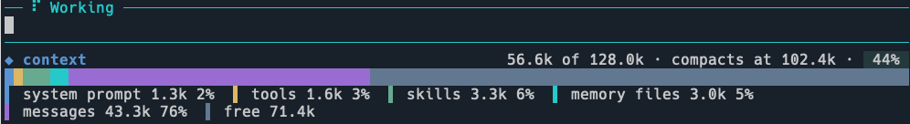

# 🧠 Context Bar

A [Pi](https://github.com/earendil-works/pi-mono) extension that adds a context-usage breakdown to the status bar, inspired by the Claude Code `/context-bar` mod.

It shows how the active model's context window is consumed across:

- **system prompt** — base instructions, rules, docs, and custom addendum
- **tools** — active built-in and extension tool definitions
- **mcp tools** — tools provided by registered MCP servers
- **skills** — loaded skill instructions
- **memory files** — project context files (e.g. `@agent.md`, `CLAUDE.md`)
- **messages** — conversation history (user, assistant, and tool results)
- **free** — remaining headroom before compaction

## 📦 Installation

### Via `pi install` (recommended)

```bash
pi install npm:@juancrg90/context-bar
```

Or install directly from this repository:

```bash
pi install git:github.com/JuanCrg90/pi-extensions@main#packages/context-bar
```

> Use `pi install -l ...` to install for the current project only.

### Manual

Copy the extension folder into Pi's extension discovery path:

```bash
# Global
mkdir -p ~/.pi/agent/extensions/context-bar
cp -r ./packages/context-bar/* ~/.pi/agent/extensions/context-bar/

# Project-local
mkdir -p .pi/extensions/context-bar
cp -r ./packages/context-bar/* .pi/extensions/context-bar/
```

## 🖼 Screenshot



## 🎮 Usage

Run the slash command to toggle the footer:

```
/context-bar
```

The footer appears at the bottom of the TUI and updates live as the conversation grows:

- A summary line with used/window tokens, compaction threshold, and usage percentage.
- A stacked bar where each color represents a context category.
- A legend showing the size and percentage of each category.

## ⚙️ How it works

- Token counts are estimated from UTF-8 text length (≈ 4 characters per token).
- The extension listens to Pi lifecycle events:
  - `before_agent_start` parses the rendered system prompt and active tools.
  - `context` sizes the conversation messages.
  - `message_end` / `agent_end` / `model_select` refresh the usage total from `ctx.getContextUsage()`.
- When Pi reports a real token total, each category is scaled proportionally so the bar and legend percentages always match the reported total usage.

## 🏗 Package Structure

```
context-bar/
├── package.json    # Pi package manifest
├── index.ts        # Re-export for `pi -e ./context-bar`
├── src/
│   ├── context.ts  # Pure helpers (token estimation, scaling, parsing)
│   └── index.ts    # Pi extension entry point and TUI renderer
├── tests/
│   └── context.test.ts
├── tsconfig.json   # Development type-checking
├── README.md
└── .gitignore
```

## 🛠 Development

Type-check and test the package:

```bash
cd packages/context-bar
pnpm exec tsc --noEmit
pnpm test
```

Test quickly without installing:

```bash
pi -e ./packages/context-bar
```

## 📋 Prerequisites

- [pi](https://github.com/earendil-works/pi-mono) ≥ 0.1.0
- Node.js (for development only)

## 🤝 Contributing

Pull requests are welcome! For major changes, please open an issue first to discuss what you would like to change.

## 📄 License

[MIT](../../LICENSE) © JuanCrg90

---
*Built with ❤️ for the Pi ecosystem.*
*Part of the [pi-extensions](https://github.com/JuanCrg90/pi-extensions) mono-repo.*
