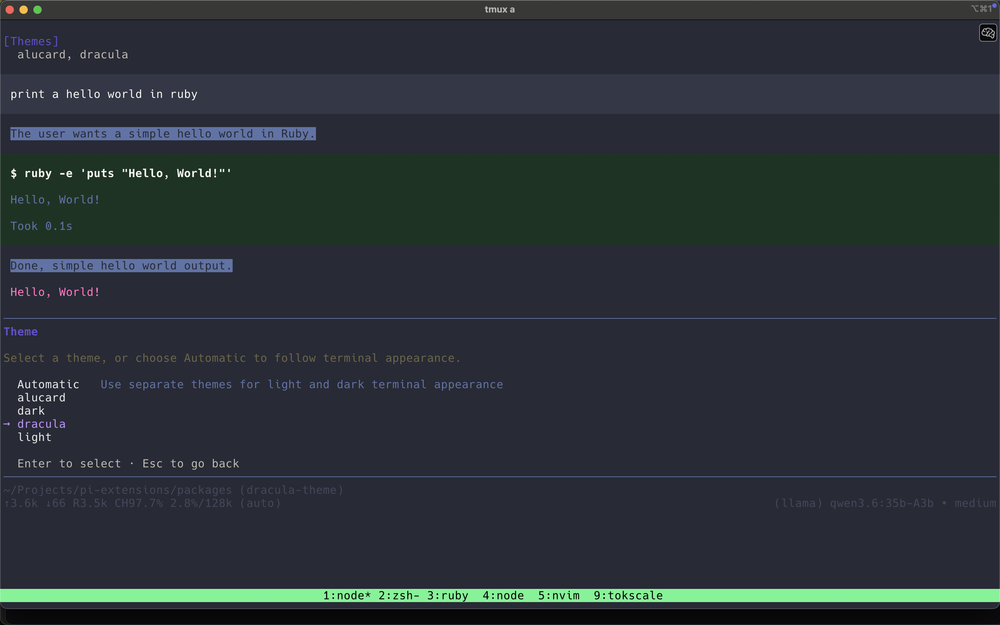
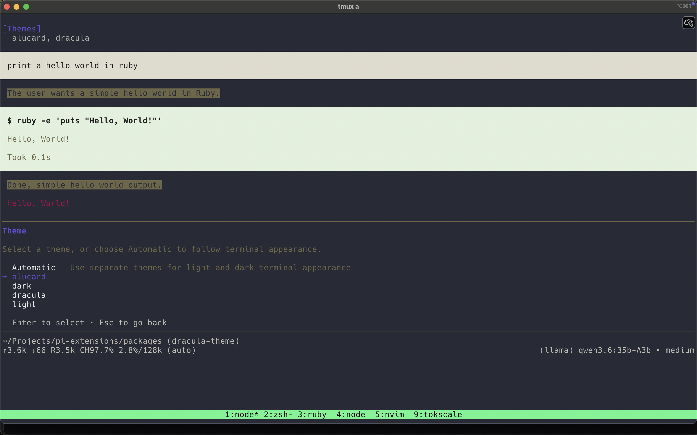

# 🧛 Dracula Themes for Pi

[Dracula Classic](https://draculatheme.com/spec) and Alucard Classic themes for [pi](https://github.com/earendil-works/pi-mono), inspired by the [Dracula Theme](https://draculatheme.com).

## Demo

### Dracula (dark)



### Alucard (light)



## Included themes

- `dracula` — dark
- `alucard` — light

## Install

```bash
pi install npm:@juancrg90/dracula-themes
```

Local dev:

```bash
pi install ./packages/dracula-themes
```

## Enable

Open `/settings` in pi, then pick:

- `dracula`
- `alucard`

Or set in settings JSON:

```json
{
  "theme": "dracula"
}
```

## Package structure

```text
dracula-themes/
├── package.json
├── README.md
├── screenshots/
│   ├── dracula-theme.png
│   └── alucard-theme.png
└── themes/
    ├── alucard.json
    └── dracula.json
```

## Notes

- Based on Dracula Theme spec colors.
- Uses a few derived background tints for tool success/error panels.
- Pi hot-reloads custom theme files while active.
