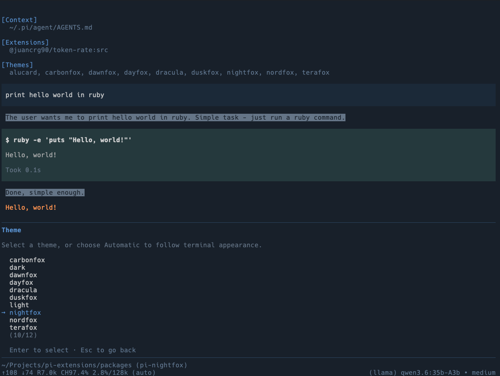
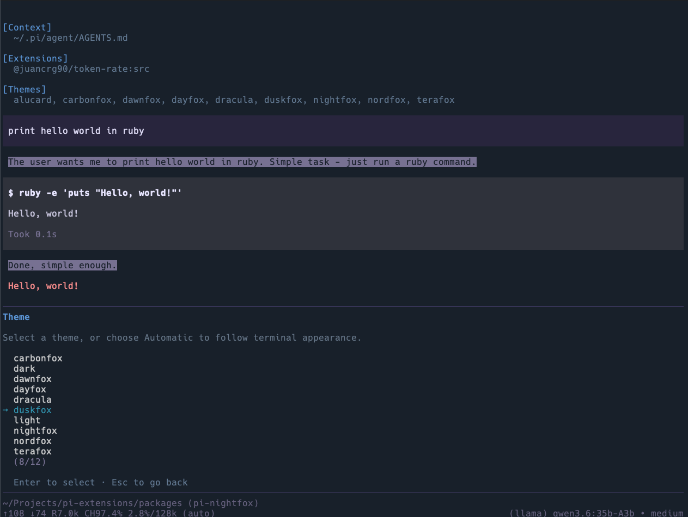
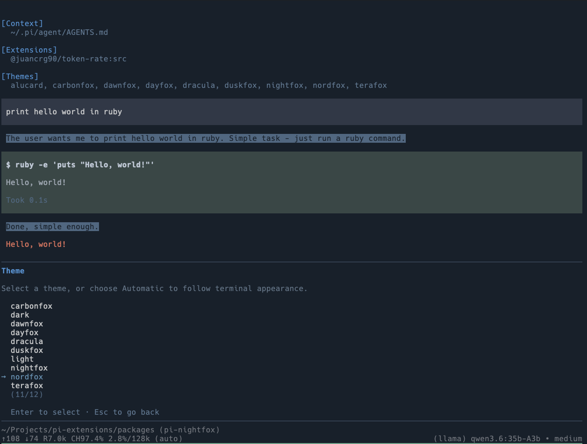
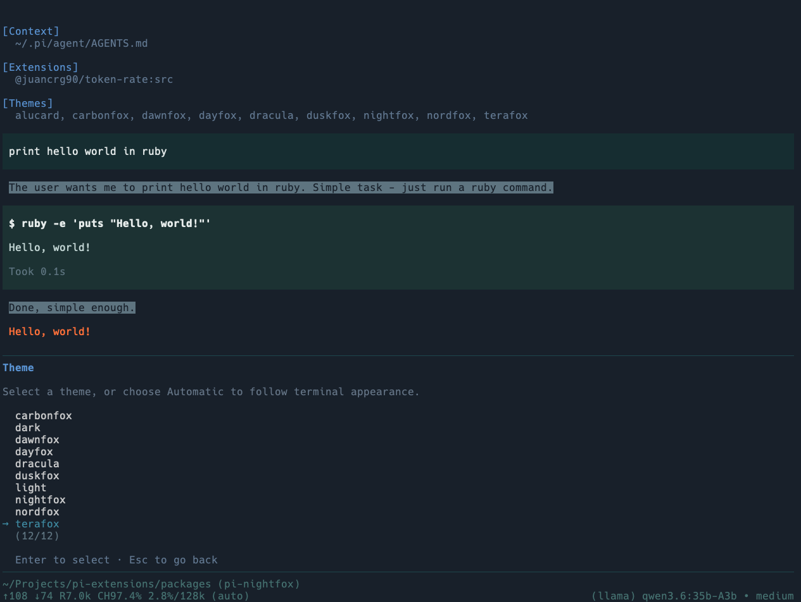
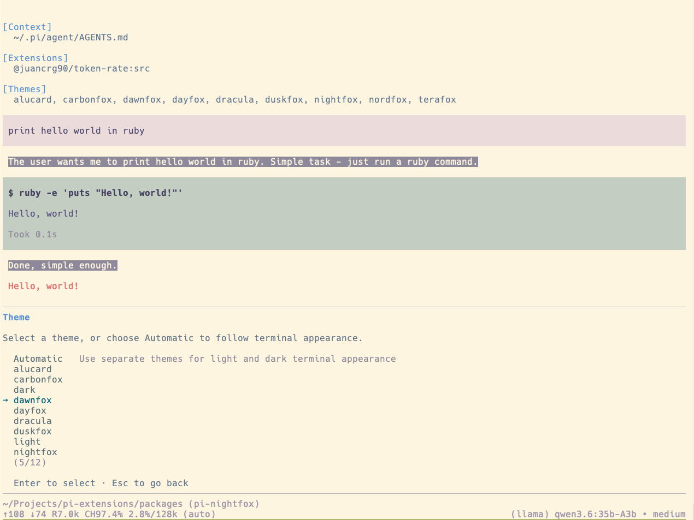
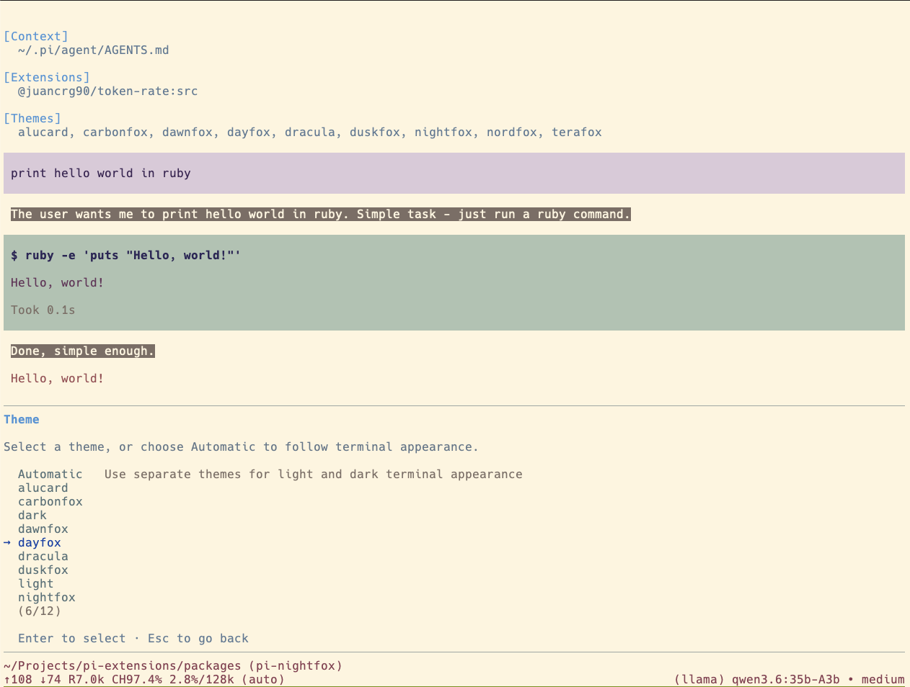

# 🦊 Nightfox Themes for Pi

Nightfox theme collection for [pi](https://github.com/earendil-works/pi-mono), based on [edeneast/nightfox.nvim](https://github.com/edeneast/nightfox.nvim).

## Demo

### Nightfox (dark)



### Duskfox (dark)



### Nordfox (dark)



### Terafox (dark)



### Dawnfox (light)



### Dayfox (light)



## Included themes

- `nightfox` — dark
- `carbonfox` — dark
- `duskfox` — dark
- `nordfox` — dark
- `terafox` — dark
- `dayfox` — light
- `dawnfox` — light

## Install

```bash
pi install npm:@juancrg90/nightfox-themes
```

Local dev:

```bash
pi install ./packages/nightfox-themes
```

## Enable

Open `/settings` in pi, then pick any of:

- `nightfox`
- `carbonfox`
- `duskfox`
- `nordfox`
- `terafox`
- `dayfox`
- `dawnfox`

Or set in settings JSON:

```json
{
  "theme": "nightfox"
}
```

## Package structure

```text
nightfox-themes/
├── package.json
├── README.md
├── screenshots/
│   ├── dayfox.png
│   ├── dawnfox.png
│   ├── duskfox.png
│   ├── nightfox.png
│   ├── nordfox.png
│   └── terafox.png
└── themes/
    ├── carbonfox.json
    ├── dawnfox.json
    ├── dayfox.json
    ├── duskfox.json
    ├── nightfox.json
    ├── nordfox.json
    └── terafox.json
```

## Notes

- Palette and theme inspiration extracted from `edeneast/nightfox.nvim`.
- Theme colors mapped into Pi's 51 required theme tokens.
- Includes exact Nightfox family names for easy switching.
